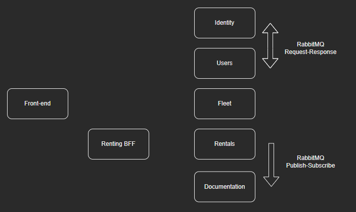

<h1 align="center">
Car Rental</h1>

## Tecnologias e Ferramentas

- .NET Core
- Entity Framework Core
- Rabbitmq
- XUnit
- [MediatR](https://github.com/jbogard/MediatR)
- [FluentValidations](https://fluentvalidation.net/)
- [Swagger](https://swagger.io/solutions/api-documentation/)

## Projeto

Projeto backend de uma aplicação distribuída, desenvolvida em .NET Core 3.1, de uma locadora de veículos.

  

## Identity

Serviço para autenticação e autorização de usuários da aplicação. Foi utilizado o próprio provedor de Identidade do ASP.NET. O serviço de identidade se comunica por mensageria com a API de Usuários. Todas os outros serviços requerem que o usuário esteja logado na API de identidade, através do token gerado por ela.

## Users

API responsável por validar e manipular dados de usuários não necessariamente ligados à parte de autenticação, como endereço, data de nascimento e afins. Como o processo de cadastro de usuário deve ser síncrono, implementei uma padrão request-reponse, ou seja, após o serviço **Identity** enviar uma mensagem para a fila, ele fica esperando uma resposta, para informar um cadastro bem sucedido para o usuário.

## Fleet

Catálogo de veículos, pra esse serviço foi implementado um CRUD simples, já que a ideia é ele servir apenas como uma base que armazena os veículos. Para adicionar ou remover veículos, é necessário estar autenticado como operador.

## Rentals

Serviço para a gestão de locações, lá são armazenados todos os detalhes da locação, valores, vistoria, etc. Como é um serviço muito dependente dos outros (**Users** e **Fleet**), coloquei um gateway entre o frontend e ele, que faz a orquestração do processo de locação. Ao registrar uma locação, o serviço envia uma mensagem para uma fila, que será consumida enventualmente pelo serviço de **Documentation**.
Por ser o coração do sistema, tem uma arquitetura mais complexa, com uma separação de camada física entre o domínio, a aplicação e a infra. Além disso, para esse caso foi implementado um padrão CQRS, para separar os comandos que requerem validações mais robustas.

## Documentation

Serviço para gerar documentos, como contratos. Esse serviço fica ouvindo uma fila, onde captura eventos de outros serviços e cadastra as informações para a geração de documentos.

## Renting BFF

API que cuida da orquestração do processo de locação, se comunicando com os demais serviços, e retirando a responsabilidade dessa orquestração do frontend.

Para ver a aplicação funcionando, segue o vídeo: https://www.youtube.com/watch?v=8Hy2Xc3Rsn0
